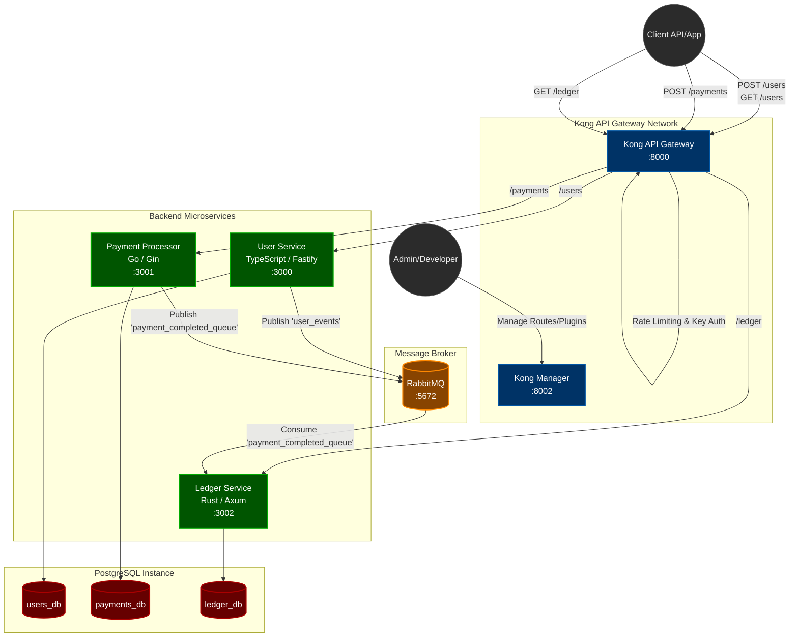

# System Architecture

Below is a detailed Mermaid diagram illustrating the architecture of our toy payment gateway system.

## Description

1. **Kong Gateway**: Acts as the single entry point for all external client traffic. It enforces cross-cutting concerns like Rate Limiting and Key Authentication. Kong Manager provides a GUI for configuring these policies.
2. **User Service**: A TypeScript/Fastify microservice that handles user registration. It saves users to the `users_db` and publishes events to RabbitMQ.
3. **Payment Processor**: A Go/Gin microservice that receives payment requests. It writes the initial "processing" state to the `payments_db` and publishes the payment details to the `payment_completed_queue` in RabbitMQ.
4. **Ledger Service**: A Rust/Axum microservice that listens to the `payment_completed_queue`. When a payment is processed, it consumes the event and records it permanently in the `ledger_db` as "COMPLETED". It also exposes a `/ledger` endpoint to list all transactions. 
5. **Data Isolation**: Each microservice maintains its own independent PostgreSQL database instance (`users_db`, `payments_db`, `ledger_db`), adhering to the database-per-service pattern.
